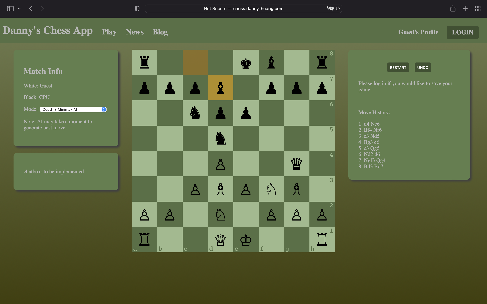

# Chess App v1

<!-- ABOUT THE PROJECT -->
## About The Project

Hello. This is a simple chess web application I created for practice.

Features:

* User authentication with the ability for users to create and login into a personal account.
* Users can play chess (either against a random move generator or a minimax AI).
* Users can save games, which they can view and replay in their profile's page.
* Users can read the latest chess-related news on the news page.
* Users can read, create, delete, and like blogs on the blog page. They can also add their saved games to blogposts for others to view.

## Built With

* [MongoDB](https://www.mongodb.com)
* [Express](https://expressjs.com/)
* [Angular](https://angular.io)
* [Node.js](https://nodejs.org/en/)

External Libraries

* [chess.js](https://github.com/jhlywa/chess.js/blob/master/README.md) (as chesss engine)
* [ngx-chess-board](https://www.npmjs.com/package/ngx-chess-board) (for chessboard visualization)
* [@kolkov/angular-editor](https://www.npmjs.com/package/@kolkov/angular-editor) (WYSIWYG text editor)

<!-- How to View -->
## How to View

You can check out this project at https://chess-app-2cafc00f02ba.herokuapp.com/

## Video Demo

https://www.youtube.com/watch?v=j4epTiEdlVs

## Future Improvements

* Allow users to play against other players locally and online.
* Implement an improved AI based on deep reinforcement learning.
* Implement chatbox to allow players to communicate during matches.
* Improve UI and UX.
* Improve data validation and security.
* Refactor code to increase efficiency and manageability.
